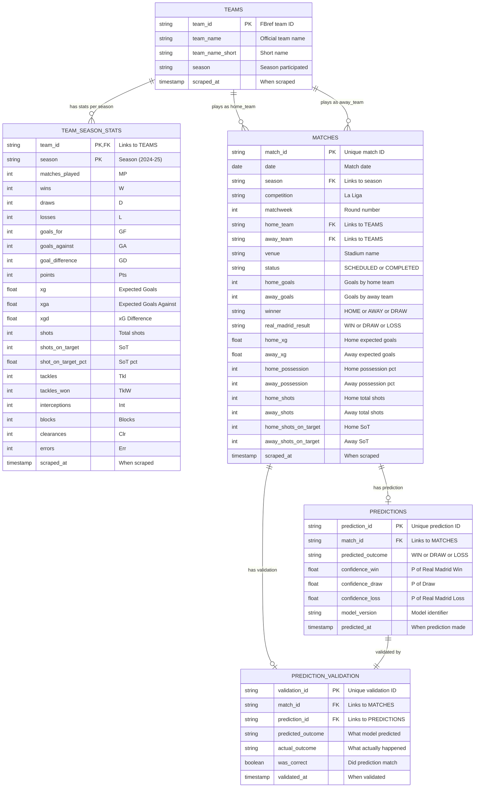

## Real Madrid Match Prediction Pipeline

🎯 Problem Statement
This project builds a production-grade machine learning pipeline to predict Real Madrid match outcomes (Win/Draw/Loss) in La Liga by leveraging historical match data and advanced performance metrics. The challenge lies in accurately forecasting soccer results—a notoriously unpredictable domain—by combining traditional statistical features (goals scored/conceded, home/away performance) with expected goals (xG) data that captures underlying team quality beyond final scores.
We tackle this by implementing an end-to-end data engineering solution: Python scrapers extract match-level data from FBref and land it as JSON in S3; PySpark jobs on AWS EMR transform raw data into partitioned Parquet files optimized for analytics; Snowflake serves as the data warehouse where dbt models engineer features like rolling averages, rest days, and opponent strength indicators; finally, a classification model (Multinomial Logistic Regression or XGBoost) trained on 3 seasons of historical data (~400 matches) generates predictions with confidence probabilities 24-48 hours before each match.
The entire pipeline is orchestrated via Airflow with idempotent design, automated validation comparing predictions against actual results, and infrastructure-as-code via Terraform—demonstrating modern data lake architecture, distributed processing with Spark, and scalable ML operationalization patterns.

#### Problem Considerations
---

- **Late Data StrategyProblem:** FBref may not publish match results immediately after games end. Match times can be delayed. Opponent data may be missing.Our Approach:Watermarking vs Reprocessing Windows

- **Problem:** FBref might add new stats (e.g., "progressive passes"), change field names, or restructure HTML.

- **Problem:** Bad data corrupts predictions. How do we catch issues before they break downstream consumers?

### Architecture
---

## Tables

| Table | Purpose | Source |
|-------|---------|--------|
| **TEAMS** | Reference table for all La Liga teams | FBref La Liga Stats page |
| **TEAM_SEASON_STATS** | Flattened squad stats (standings + shooting + defense) | FBref La Liga Stats page |
| **MATCHES** | All Real Madrid matches (past + scheduled) | FBref RM Fixtures + Match Details |
| **PREDICTIONS** | Model outputs before each match | ML Model |
| **PREDICTION_VALIDATION** | Actual vs predicted comparison | Pipeline |

## Airflow Set Up

